# library-management-system-
Library management system is a real - life based system used in school/college libraries . It works for both students and management staff (admin).MySQL is used as database for this system , and python language is used in this system . It is a terminal based real-world library system simulator . Uses different dashboards for admin or students (login).

# functions=>
1. add student in database 
2. add books 
3. issue book
4. return book
5. delete books
6. remove student from database
7. view list of books
8. view student history of book issue
9. check dues for a student
10. search for a book using bookid/name

# preview=>
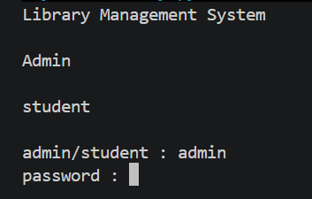

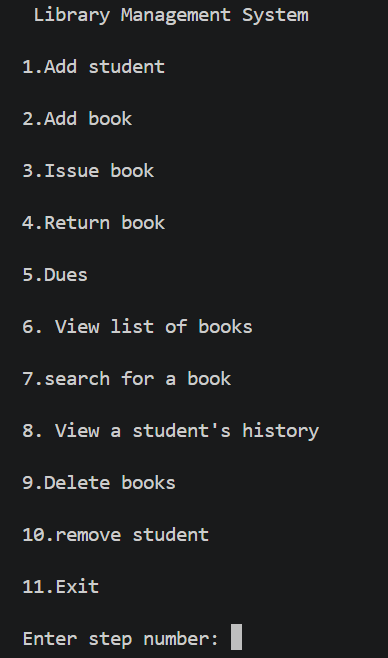

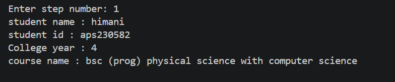

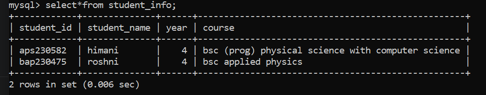

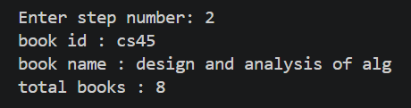

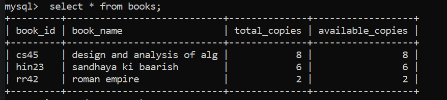

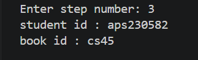

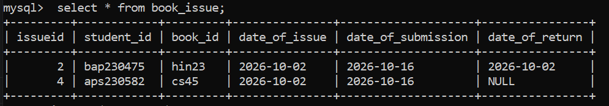

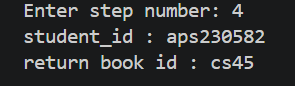

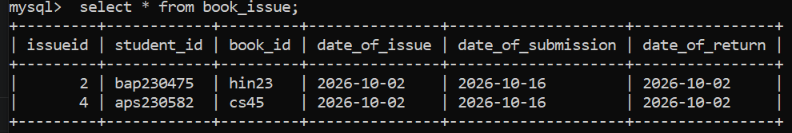

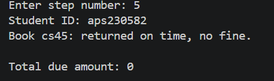

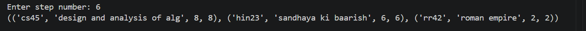

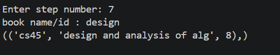

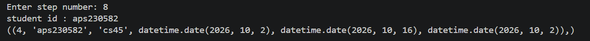

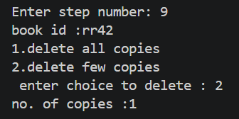

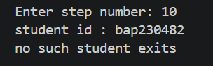

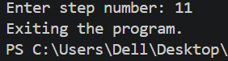
