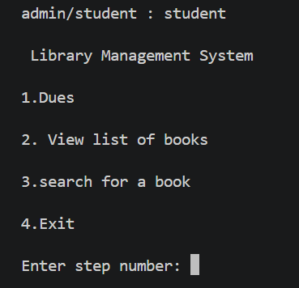

# library-management-system-
Library management system is a real - life based system used in school/college libraries . It works for both students and management staff (admin).MySQL is used as database for this system , and python language is used in this system . It is a terminal based real-world library system simulator . Uses different dashboards for admin or students (login).

# functions=>
1. add student in database 
2. add books 
3. issue book
4. return book
5. delete books
6. remove student from database
7. view list of books
8. view student history of book issue
9. check dues for a student
10. search for a book using bookid/name

# preview=>
1. login as admin
     

2. admin dashboard
      

3. adding a student
     

4. database after adding a student
     

5. adding a book
    

6. database after adding a book
    

7. issueing a book
    

8. database 
    

9. returning a book
    

10. database
    

11. checking dues for a student
    

12. viewing books
    

13. searching for a book
    

14. student history
    

15. deleting books
    

16. removing a student
   

17. exiting
   

18. student dashboard
      

